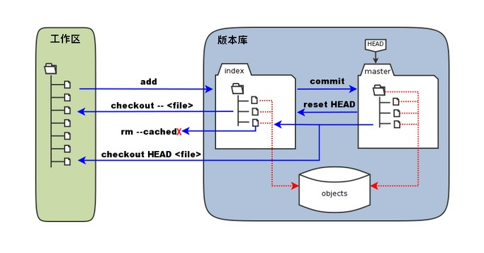

# git 工作流程

- **工作区：**本地可见的目录。
- **暂存区：**英文叫 stage 或 index。一般存放在  .git 目录下的 index 文件（.git/index）中，所以我们把暂存区有时也叫作索引（index）。
- **版本库：**工作区有一个隐藏目录 .git，这个不算工作区，而是 Git 的版本库。

# git 存储模型

git将一个目录下的所有文件与目录结构分为两部分：文件内容，目录结构（包含文件名和目录名，以及文件和目录的元信息）

- **对于文件内容**：通过bolb对象保存，如果两个文件内容相同，则他们在git中由同一个bolb对象保存，bolb对象存着文件的内容，并且通过内容的SHA-1值当作对象的ID，通过ID可以唯一确定一个bolb对象。

- **对于目录结构**：通过tree对象保存，一个目录用一个tree对象保存，tree对象中存储本目录下的所有文件的元信息（如文件名），以及文件或子目录对应的bolb对象ID和tree对象的ID,以便找到文件bolb对象和下级目录tree对象。

只要有当前状态下的所有bolb对象和tree对象就能保存仓库的当前状态，即git快照

只要有当前状态下的根目录的tree对象就能得到所有的bolb对象和tree对象。

由此可见，如果当前版本和前一个版本的某个文件如果内容相同，则他们用同一个bolb对象存储，且任何版本中内容相同的文件无论是否是同一个文件名和目录都由同一个bolb存储

# git 版本控制

git每次commit都会创建一个版本，版本通过commit对象存储。

版本对象的大致内容：

- 根目录的tree对象ID
- 文件的作者
- commit提交者

- commit说明
- **父commit对象**

通过父commit对象这项内容，可以将所有的commit对象串成一个树，子节点是由父节点修改并commit而来

# git分支控制

git的核心就是串成树的commit以及所有commit都共享的对象库，分支只不过是一个指向树中某个commit的指针

创建一个分支就是创建一个指针指向某个commit对象。当前分支用另一个指针HEAD再指向分支指针。此外HEAD还可以不指向分支指针，直接指向commit对象，称作HEAD游离状态（detached head），此时做出提交并不会修改任何分支

# git 分布式仓库
