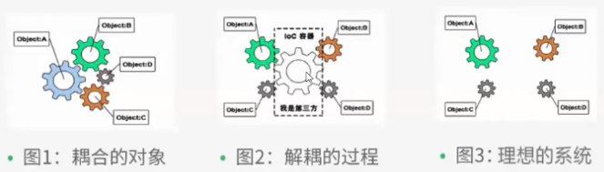

# Java Spring

## 关于Spring

- 2002年推出spring雏形interface21框架

- 2004年3月24日spring框架以interface21框架为基础，经过重新设计发布spring1.0

- Rod Johnson Spring Framework 创始人，悉尼大学音乐学博士

- Spring 理念：使现有技术更加容易使用，整合现有技术框架

- 轻量级，非入侵式，控制反转(Ioc)，面向切面编程(AOP)，


- SSH: Struct2+Spring+Hibernate!

- SSM:SpringMvc+Spring+Mybatis!

### Maven导入方法

官网： https://spring.io/projects/spring-framework#overview

官方下载地址：http://repo.spring.io/release/org/springframework/spring

github：https://github.com/spring:projects/spring-framework

```xml
<!-- https://mvnreposi tory . com/artifact/org. springframework/spring-webmvc -->
<dependency>
    <groupId>org.springframework </groupId>
    <artifactId> spring-webmvc </artifactId>
    <version>5.2.0. RELEASE</version>
</dependency>
<!-- https://mvnrepository.com/artifact/org.springframework/spring-webmvc -->
<dependency>
    <groupId>org.springframework</ groupId>
    <artifactId>spring-jdbc</artifactId>
    <version>5.2.0.RELEASE</version>
</dependency>
```

### Spring 组成


### 其他


- SpringBoot
  - 快速开发的脚手架
  - 给予SpringBoot可快速开发单个微服务
  - 约定＞配置

- Spring Cloud
  - Spring Cloud 是基于SpringBoot实现

Spring弊端：配置繁琐，配置地狱

## IOC控制反转



### 正常设计方式

1. UserDao

   ```java
   public interface UserDao{
   	void getUser();
   }
   ```

2. UserImpl

   ```java
   public class UserDaoImpl implements UserDao{
       public void getUser(){
           system.out.println("默认获取用户数据");
       }
   }
   ```

3. UserService

   ```java
   public interface UserService{
       public void getUser();
   }
   ```

4. UserServiceImpl

   ```java
   public class UserServiceImpl implements UserService{
       //此处UserServiceImpl依然依赖UserDaoImpl无法做到抽象依赖
       private UserDao userDao = new UserDaoImpl();
       public void getUser(){
           userDao.getUser();
       }
   }
   ```

5. 上层

   ```java
   public class Test{
   	public static void main(String args[]){
           //此处依然依赖UserServiceImpl实现类，而不只依赖抽象接口
           UserSevice userService = new UserServiceImpl();
           userService.getDao();
   	}
   }
   ```


### IOC设计方法:

IOC即控制反转，指的是程序依赖的成员类由set函数或者构造函数传入，可以传入接口引用从而取消对实现类的直接依赖，降低耦合性。

对于Service层

UserServiceImpl

```java
public class UserServiceImpl implements UserService{
	//此处只依赖UserDao接口不依赖UserDaoimpl 减少耦合性
    private UserDao userDao;
    public void setUserDao(UserDao userDao){
        this.userDao = userDao;
    }
    public void getUser(){
        this.userDao.getUser();
    }
}
```

### Spring 中的Ioc设计

Spring中可以使用：XML,注解，自动装配等方式实现控制反转。

Spring首先读取xml文件，根据xml文件中的内容通过Java创建类型 ，再注入依赖

上层调用底层的类只需要依赖Spring中的容器，并让容器读取xml文件即可按照xml的配置创建对象。

#### 例(hello spring)

Say接口(java/com.example.pojo/Say.java)

```java
public interface Say{
    public void show();
}
```

Hello类(java/com.example.pojo/Hello.java)

```java 
public class Hello{
    private String name;
    
    public String getName(){
        return this.name;
    }
    
    public void setName(String name){
        this.name = name;
    }
    
    public void show(){
        system.out.println("hello"+name);
    }
}
```

xml配置(resources/beans.xml)

```xml
<?xml version="1.0" encoding="UTF-8"?>
<beans xmlns="http://www.springframework.org/schema/beans"
    xmlns:xsi="http://www.w3.org/2001/XMLSchema-instance"
    xsi:schemaLocation="http://www.springframework.org/schema/beans
        https://www.springframework.org/schema/beans/spring-beans.xsd">

    <bean id="hello" class="com.example.pojo.Hello">
    	<property name = "str" value = "Spring">
    </bean>
</beans>
```

通过xml加载Hello为Say接口实例

```java
public class Test{
	public static void main(String args[]){
        //创建控制翻转容器
        AppcationContext context = new ClassPathXmlApplicationContext("beans.xml");
        //获取实现了Say的对象
        //此处并不直接依赖Hello 只依赖Say接口
       	Say canSay = (Say)context.getBean("hello");
       	canSay.show();
    }
}
```

### Spring IOC的实现原理

//TODO


### 总结

Ioc由 spring容器创建，管理，装配

## 对象的创建

### 创建时机

当配置文件被容器加载时，xml中配置的bean就已经被初始化了。

### 创建方法

- 无参构造函数

  - 当类没有实现构造函数或实现了一个无参构造函数，则采用set注入的方式会调用自动生成的无参构造函数或自定义的无参构造函数。

- 有参构造函数

  当类实现了有参构造函数并在xml中指定了\<constructor-arg\>或者\<constructor-ref\>就会调用相应的构造函数创建。

  ```xml
  <bean id = "user" class = "com.example.pojo.User">
      <constructor-arg index = "0" value = "dafsadfasdf"></constructor-arg>
  </bean>
  ```

  ```xml
  <bean id = "user" class = "com.example.pojo.User">
      <constructor-arg type = "java.lang.String" value = "dafsadfasdf"></constructor-arg>
  </bean>
  ```

  ```xml
  <bean id = "user" class = "com.example.pojo.User">
      <constructor-arg name = "name" value = "dafsadfasdf"></constructor-arg>
  </bean>
  ```

  

## Spring的配置

### 别名

通过别名获取对象

```xml
<alias name = "id" alias = "别名">
```

### Bean

```xml
<!--
id : bean的唯一标识符
class : bean 对象的全限命名:包名+类型
name: bean的别名同alias，多个别名可以用空格逗号分号等分割
-->
<bean id = "bean的id" class="bean的类型"  name = "别名1,别名2，....">
    <property name = "name" value="值">
</bean>
```

### import

用于团队开发,将多个配置文件导入。

```xml
<import resource="bean1.xml">
```

- 

## 依赖注入

### 构造器注入

```java
class User{
	private String username;
	private String number;
	public void User(String username,String number){
		this.username = username;
        this.number = number;
    }
	.......
}
```


```xml
<bean id="user" class="com.example.pojo.User">
	<constructor-arg name="username" value="洲洲"></constructor-arg>
	<constructor-arg name="number" value="123456"></constructor-arg>
</bean>
```

### set注入

```java
public class Student{
    private String name;
    private Address address;
    private String[] books;
    private list<String> hobbys;
    private Map<String,String> card;
    private Set<String> games;
    private String wife;
   	private Properties info;
	.......     
}
```

xml

```xml
<bean id = "address" class = "com.kuang.pojo.Address"/>
<bean id="student" class="com.example.pojo.Student">
    <!--String-->
    <property name="name" value="danny"/>
    
    <!--list-->
    <property name = "address" ref="address"/>
    
    <!--array-->
    <property name = "books">
        <array>
            <value>红楼梦</value>
            <value>西游记</value>
        </array>
    </property>
    
    <!--list-->
    <property name = "hobbys">
        <list>
            <value>听歌</value>
            <value>看电影</value>
        </list>
    </property>
    
    <!--map-->
    <property name = "card">
        <map>
        	<entry key= "身份证" value="21345678"/>
            <entry key= "银行卡" value="123456789"/>
        </map>
    </property>
    
    <!--Set-->
    <property name="games">
        <set>
            <value>LOL</value>
            <value>COD</value>
        </set>
    </property>
    <!--null-->
    <property name="wife">
        <null/>
    </property>
</bean>
```


### p命名空间和c命名空间注入

p代指property ,c代指constructor，它们是构造器注入和set注入的快捷方式

若要使用需要导入命名空间

```xml
<beans xmlns="http://www.springframework.org/schema/beans"
	   xmlns:p="http://www.springframework.org/schema/p"<!--导入p-->
	   xmlns:c="http://www.springframework.org/schema/c"<!--导入c-->
       xmlns:xsi="http://www.w3.org/2001/XMLSchema-instance"
       xsi:schemaLocation="http://www.springframework.org/schema/beans
                           https://www.springframework.org/schema/beans/spring-beans.xsd">

</beans>
```


对于下面这个类

```java
class MyClass
{
   	private String prop1;
    public void MyClass(String prop1){
        this.prop1 = prop1;
    }
    .....//set get
}
```

#### p命名空间创建

```xml
<bean id = "id" class = "com.exam...." p:prop1 = "value"/>
```

#### c命名空间创建

```xml
<bean id = "id" class = "com.exam...." c:prop1 = "value"/>
```

## Bean作用域

| Scope                                                        | Description                                                  |
| ------------------------------------------------------------ | ------------------------------------------------------------ |
| [singleton](https://docs.spring.io/spring-framework/docs/5.2.0.RELEASE/spring-framework-reference/core.html#beans-factory-scopes-singleton) | (Default) Scopes a single bean definition to a single object instance for each Spring IoC container. |
| [prototype](https://docs.spring.io/spring-framework/docs/5.2.0.RELEASE/spring-framework-reference/core.html#beans-factory-scopes-prototype) | Scopes a single bean definition to any number of object instances. |
| [request](https://docs.spring.io/spring-framework/docs/5.2.0.RELEASE/spring-framework-reference/core.html#beans-factory-scopes-request) | Scopes a single bean definition to the lifecycle of a single HTTP request. That is, each HTTP request has its own instance of a bean created off the back of a single bean definition. Only valid in the context of a web-aware Spring `ApplicationContext`. |
| [session](https://docs.spring.io/spring-framework/docs/5.2.0.RELEASE/spring-framework-reference/core.html#beans-factory-scopes-session) | Scopes a single bean definition to the lifecycle of an HTTP `Session`. Only valid in the context of a web-aware Spring `ApplicationContext`. |
| [application](https://docs.spring.io/spring-framework/docs/5.2.0.RELEASE/spring-framework-reference/core.html#beans-factory-scopes-application) | Scopes a single bean definition to the lifecycle of a `ServletContext`. Only valid in the context of a web-aware Spring `ApplicationContext`. |
| [websocket](https://docs.spring.io/spring-framework/docs/5.2.0.RELEASE/spring-framework-reference/web.html#websocket-stomp-websocket-scope) | Scopes a single bean definition to the lifecycle of a `WebSocket`. Only valid in the context of a web-aware Spring `ApplicationContext`. |

### singleton

singleton是单例模式，多次getBean只创建一个，且多个其他bean引用该bean也指向的是同一个对象,它是bean的默认模式

```xml
<!--显示指明-->
<bean id = "user" class = "..." scope = "singleton">
<!--默认就是singleton-->
<bean id = "user" class = "...">
```

### prototype

prototype是原型模式，多次getBean获取时都会创建，且多个其他bean引用的都是不一样的

```xml
<bean id = "user" class = "..." scope = "prototype">
```

### request,session,application，websocket

这些只在web中用到


## 自动装配

- 自动装配是Spring满足bean依赖的一种方式

- Spring会在上下文中自动寻找，并自动给bean装配属性

Spring有三种装配方式

1.在xml中显式配置

2.在Java中显式配置

3.隐式自动装配bean（重要）

### 例子

```java
public class Cat{
   	public void bark(){
        System.out.println("miao");
    }
}
```


```java
public class Dog{
    public void bark(){
        System.out.println("Wang~");
    }
}
```


```java
public class Human{
	private Cat cat;
	private Dog dog;
	private String name;
}
```


```xml
<?xml version="1.0" encoding="UTF-8"?>
<beans xmlns="http://www.springframework.org/schema/beans"
    xmlns:xsi="http://www.w3.org/2001/XMLSchema-instance"
    xsi:schemaLocation="http://www.springframework.org/schema/beans
        https://www.springframework.org/schema/beans/spring-beans.xsd">
    
    <bean id = "cat" class = "...."/>
    <bean id = "dog" class = "...."/>
    <bean id = "human" class = "...."/>
    <!--原本的装配方式-->
    <bean id ="people" class = "...">
    	<property name = "name" value = "Danny"/>
        <property name = "dog" ref = "dog"/>
        <property name = "cat" ref = "cat"/>
    </bean>
    <!--自动装配方式-->
    <!--byName 会自动在容器上下文中自动寻找id与get set方法名get/set后面的名字相同的Bean-->
    <!--byType 会自动在容器上下文中自动寻找本身与bean类型，此种情况被引用的bean可以省略id-->
    
    <bean id = "human" class = "..." autowire = "byName">
    	<property name = "name" value = "adfasfd"/>
    </bean>
</beans>


```

### 基于注解的自动装配

#### @Autowired注解

要使用注解需要导入约束和配置注解的支持

配置注解：配置

```xml
<?xml version="1.0" encoding="UTF-8"?>
<beans xmlns="http://www.springframework.org/schema/beans"
       xmlns:xsi="http://www.w3.org/2001/XMLSchema-instance"
   	   xsi:schemaLocation="http://www.springframework.org/schema/beans
                           https://www.springframework.org/schema/beans/spring-beans.xsd
                           https://www.springframework.org/schema/context/spring-context.xsd"
       >
    <!--开启注解支持-->
    <context:annotation-config/>
    <bean id = "foo" class="..."></bean>
	<bean id = "bar" class="..."></bean>
    <bean id = "hello" class="..."></bean>
</beans>
```


```java
public class hello{
    @Autowired(required = false)
    private Foo foo;
    @Autowired
    private Bar bar;
    //.....set get方法
	//@Autowired还可以放在set方法上面，当autowired放在字段上时可以省略set方法
    //@Autowired参数require=false时所配置的属性可以为NULL
    //当xml中有多个bean对象当前字段相同时可以在autowire下面加上@Qualifier(value = "id")指定bean对象的id
}
```

#### @Resource注解

```java
public class hello{
	@Resource(name = "foo")
    private Cat cat;
    @Resource
    private Bar bar;
}
```

**@Resource和@Autowired的区别**

- @Autowired使用的是byType，而且必须要求对象存在，如果允许NULL值可以设置require参数为false

- @Resource使用的是byname，但是找不到名字时就使用byType实现，如果没有指定name参数，就按照字段名当做name值

- @Resource装配顺序
  1. 如果同时指定name和type，则从容器中查找唯一匹配的bean装配，找不到则抛出异常
  2. 如果指定name属性，则从容器中查找名称匹配的bean装配，找不到则抛出异常
  3. 如果指定type属性，则从容器中查找类型唯一匹配的bean装配，找不到或者找到多个抛出异常
  4. 如果都不指定，则自动按照byName方式装配，如果没有匹配，则回退一个原始类型进行匹配，如果匹配则自动装配

- @Autowire和@Qualifier配合使用效果和@Resource一样：

  ```java
  @Autowired(required = false) @Qualifier("example")
  private Example example;
  
  @Resource(name = "example")
  private Example example;
  ```

## Spring注解开发

### @Component 

写在类前面，说明这个类为bean，当在xml中配置了

```xml
<!--搜索包下面配置了Component的类-->
<context:component-scan base-package="要扫描的包"/>
```

时，会自动配置指定包下的类为id = 类名小写的bean。

衍生注解它们和`@Component`功能一样

- dao层 `@Repository` 

- service层 `@Service`

- controller层`@Controller`

### @Value(值)

放到类的字段前面，相当于\<bean\>标签中的:

```xml
<property name = "name" value = "value">
```

### @Scope(值)

放到@Component 下面用于指定作用域,相当于bean标签的scope属性


## JavaConfig配置Spring

这种方式不需要配置xml文件，全靠Java文件进行配置

AnnotationConfigApplicationContext类传入一个JavaConig类充当xml

### @Configuration&@Bean

```java
@Configuration
public class AppConfig{
    @Bean
    public MyService myService(){
        return new MyServiceImpl();
    }
}
```

- @Configuration 相当于`<beans>`标签
- @Bean 写在方法前，相当于`<bean>`标签，id = 方法名，class = 方法返回值

```java
ApplicationContext context = new AnnotationConfigApplicationContext(AppConfig.class);
var obj = （MyService）context.getBean("myService");
```

@Configuration 也会配置@Component

### @ComponentScan(包名)

@ComponentScan 写在Config类前，用于扫描@Component

相当于(?)

```xml
<context:component-scan base-package="要扫描的包"/>
```

### @import(JavaConfig类型)

相当于`<import resource="bean1.xml">`,但从JavaC

## 代理模式与AOP

### 静态代理

Foo的抽象接口

```java
public interface Foo{
    public void showFoo();
}
```

Foo的一个实现

```java
public class FooImpl{
    @override
    public void showFoo(){
        System.out.println("Foo~");
    }
}
```

对foo的代理，在调用成员函数前后添加其他操作。

```java
public class Proxy implements Foo{
    private Foo foo;
    public void setFoo(Foo foo){
        this.foo = foo;
    }
    @override
    public void showFoo(){
        //log
        System.out.println("[Debug] calling foo.showFoo");
        this.foo.showFoo();
        System.out.println("[Debug] returned from foo.showFoo");
    } 
}
```

这种设计模式遵循不更改原有类的条件下附加操作。

对于分层的类结构，可以在每一层增加一层中间层(代理类)用于打印日志（AOP）

### 动态代理

动态代理的代理类是动态生成的，有以下几种实现：

- 基于接口的动态代理--JDK动态代理

- 基于类的动态代理--cglib
- 基于Java字节码实现--javasist 
  - javasist是动态管理Java字节码的库

Proxy类可以用于动态生成代理类，但必须要给出一个处理类，当调用被代理的方法时自动调用InvocationHandler的invoke方法。

```java
public interface Foo{
    public void sayHello();
}
```

//被代理类的实现类

```java
public class FooImpl implements Foo{
 	@Override
    public void sayHello(){
        System.out.println("foo~");
    }
}
```

InvocationHandler实现类

```java
public class FooInvocationHandler implements InvocationHandler{
    private Foo foo;
    public setFoo(Foo foo){
        this.foo = foo;
    }
    public Foo getFoo(){
        return this.foo;
    }
    public Object invoke(Object proxy,Method method,Object[] args) throws Throwable{
        System.out.println("calling function");
        return method.invoke(this.foo,args);
    }
}
```

生成代理类

```java
//创建被代理对象
Foo foo = new Foo();
//创建“调用处理对象”
fooInvocationHandler handler = new FooInvocationHandler();
//配置代理对象的“调用处理对象”，设置被调用对象
handler.setFoo(foo);
//生成foo代理对象
Foo fooProxy = Proxy.newProxyInstance(
	foo.getClass().getClassLoader(),
    foo.getClass().getInterfaces(),
    handler
);
```

## Spring中的AOP

提供声明式事务，允许用户自定义切面

- 横切关注点：跨越多个模块方法或功能，与业务逻辑无关的但需要关注的部分就是横切关注点，如日志，安全，缓存，事务。需要插入额外逻辑的点
- 切面（Aspect）：横切关注点被模块化的特殊对象，即一个类，如日志类
- 通知（Advice）：切面需要完成的工作，即类的方法，如日志类的方法
- 目标（Target）：被通知的对象，被代理类的方法。
- 代理（Proxy）：向目标对象应用通知后创建的对象。代理类
- 切入点（PointCut）：切面通知执行的位置
- 连接点（JointPoint）：与切入点匹配的执行点

需要导入织入包

```xml
<dependency>
    <groupId>org.aspectj</groupId>
    <artifactId>aspectjweaver</artifactId>
    <version>1.9.4</version>
</dependency>
```

### 实现方法一:Spring接口

目标接口

```java
public interface UserService{
	public void insert();
   	public void delete();
    public void update();
    public void select();
}
```

目标实现类

```java
public class UserServiceImpl implements UserService{
	public static void say(String call){
        System.out.println(call+"()");
    }
    public void insert(){
        say("insert");
    }
    public void delete(){
        say("delete");
    }
    public void update(){
        say("update");
    }
    public void select(){
        say("select");
    }
}
```

调用前织入的逻辑

```java
public PreLog implements MethodBeforeAdvice{
    //method :要执行的目标方法
    //args：参数
    //target：目标对象
    public void befor (Method method ,Object[] args,Object target) throws Throwable{
        System.out.println(method.getClass().getName()+" pre-call");
    }
}
```
在调用后织入的逻辑
```java
public PostLog implements AfterReturnningAdvice{
	//returnVal是函数的返回值
    public void afterReturnning(Object returnVal,Method method,Object[] args,Object target)throws Throwable{
        System.out.println("function " +method.getName()+" returned. return value is :"+returnVal);
    }
}
```


XML配置

```xml
<bean id="userService" class= "com.danny.service.UserServiceImpl"/>
<bean id = "prelog" class = "..."/>
<bean id = "postLog" class = "..."/>
<!--配置aop-->
<aop:config>
    <!--切入点,被切入的Bean类-->
    <aop:pointcut id = "pointcut" expression="execution(* com.danny.service.UserServiceImpl.*(..))"/>
    <!--到达切入点时调用的类-->
    <aop:advisor advice-ref = "preLog" pointcut-ref = "pointcut"/>
    <aop:advisor advice-ref="postLog" pointcut-ref = "pointcut">
</aop:config>
```

当要织入的类实现了AfterReturningAdvice接口，则会在目标执行后被调用。

当织入的类实现了BeforeReturnningAdvice接口，则会在目标执行前被调用

### 实现方法二

需要织入的逻辑

```java
public class PointCut{
    public void before(){
  		...      
    }
    public void after(){
        ...
    }
}
```

xml配置

```xml
<bean id = "pointCut" class = "com.danny.PointCut"/> <!--自定义切入处理对象-->

<aop:config>
    <!--定义切入面（要切入的类）-->
    <aop:aspect ref = "pointCut">
        <!--切入点设置-->
    	<aop:pointcut id = "point" express = "execution(* com.danny.Foo.*(..))"/>
        <!--指定切入点调用前和调用后的逻辑-->
        <aop:before method="before" pointcut-ref = "point"/>
        <aop:after method="after" pointcut-ref = "point"/>
    </aop:aspect>
</aop:config>
```

### 注解实现AOP

> 开启注解支持

```xml
<aop:aspectj-autoproxy/>
```

#### @Aspect

标注该类是，需要被织入的，写在需要织入的类前

相当于\<aop:aspect\>定义切入面

#### @Before("execution(* ......)") 和 @After("execution(* ......)")

写在需要被织入的类的成员方法前面。

@Before相当于\<aop:before\>

@After相当于\<aop:after\>

它们都是无参无返回，无法获取目标的返回值。

#### @Around("execution....")

```java
public void around(ProceedingJoinPoint jp) throws Throwable{
	Signature signature = jp.getSignature();//获取需要执行的签名
    //执行前
    //执行
    Object returnVal = jp.proceed();
    //执行后
    
}
```

//注意：当Before，After和Around同时使用时，顺序如下

- around中前半部分
- before
- around中后半部分
- after

