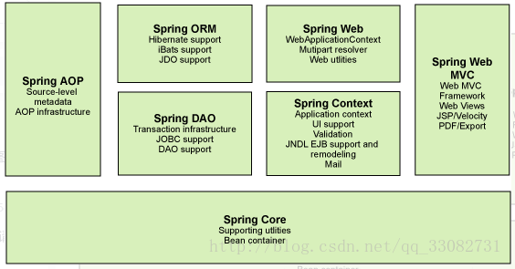

#  1.关于Spring

## 1.1 关于

- 2002年推出spring雏形interface21框架
- 2004年3月24日spring框架以interface21框架为基础，经过重新设计发布spring1.0
- Rod Johnson Spring Framework 创始人，悉尼大学音乐学博士
- Spring 理念：使现有技术更加容易使用，整合现有技术框架
- 轻量级，非入侵式，控制反转(Ioc)，面向切面编程(AOP)，

相关框架：

- SSH: Struct2+Spring+Hibernate!
- SSM:SpringMvc+Spring+Mybatis!

组成：




## 1.2 mave导入方法

官网： https://spring.io/projects/spring-framework#overview

官方下载地址：http://repo.spring.io/release/org/springframework/spring

github：https://github.com/spring:projects/spring-framework

```xml
<!-- https://mvnreposi tory . com/artifact/org. springframework/spring-webmvc -->
<dependency>
    <groupId>org.springframework </groupId>
    <artifactId> spring-webmvc </artifactId>
    <version>5.2.0. RELEASE</version>
</dependency>
<!-- https://mvnrepository.com/artifact/org.springframework/spring-webmvc -->
<dependency>
    <groupId>org.springframework</ groupId>
    <artifactId>spring-jdbc</artifactId>
    <version>5.2.0.RELEASE</version>
</dependency>
```

# 2.Spring IOC

IOC即控制反转，指的是程序依赖的成员类由set函数或者构造函数传入，可以传入接口引用从而取消对实现类的直接依赖，降低耦合性。


## 2.1 IOC概念

### 正常的设计方式

- Dao层：

  - 1.UserDao

    ```java
    public interface UserDao{
    	void getUser();
    }
    ```

  - 2.UserImpl

    ```java
    public class UserDaoImpl implements UserDao{
        public void getUser(){
            system.out.println("默认获取用户数据");
        }
    }
    ```

- Service层

  - 1.UserService

    ```java
    public interface UserService{
        public void getUser();
    }
    ```

  - 2.UserServiceImpl

    ```java
    public class UserServiceImpl implements UserService{
        //此处UserServiceImpl依然依赖UserDaoImpl无法做到抽象依赖
        private UserDao userDao = new UserDaoImpl();
        public void getUser(){
            userDao.getUser();
        }
    }
    ```

- Controller层

  - Test:

    ```java
    public class Test{
    	public static void main(String args[]){
            //此处依然依赖UserServiceImpl实现类，而不只依赖抽象接口
            UserSevice userService = new UserServiceImpl();
            userService.getDao();
    	}
    }
    ```


### IOC的设计方式

修改上述Service层代码，调用Dao层时不直接new dao层的具体实现类，而是由上层传递给自己。

```java
public class UserServiceImpl implements UserService{
	//此处只依赖UserDao接口不依赖UserDaoimpl 减少耦合性
    private UserDao userDao;
    public void setUserDao(UserDao userDao){
        this.userDao = userDao;
    }
    public void getUser(){
        this.userDao.getUser();
    }
}
```

## 2.2 SpringIOC容器

类之间的依赖关系靠Spring容器处理，spring会根据配置将依赖的对象注入给要构造的类。

Spring容器有两个接口：

- BeanFactory
- (Web)ApplicationContext

Spring 容器是生成Bean实例的工厂，并管理容器中的Bean，Bean是Spring 管理的基本单位。

在基于Spring 的Java EE 应用中，所有的组件都被当成Bean处理，包括数据源，事务管理器等等。

### BeanFactory

```java
public static void main(String[] args) {
	//初始化Spring容器，加载配置文件
    BeanFactory beanFac = new XmlBeanFactory(
		new FileSystemResource("./applicationContext.xml")
	);
    //通过容器获取test实例
    TestDao tt = (TestDao)beanFac.getBean("test");
	tt.sayHello();
}
```

### (Web)ApplicationContext

ApplicationContext是BeanFactory的子接口

WebApplicationContext是ApplicationContext的子接口

它们可以打开多个配置文件，更常用，包含几个实现类或子接口：

- FileSystemXmlApplicationContext类

  以基于文件系统的XML配置文件创建ApplicationContext 实例。从**项目路径**下开始找

  ```java
  //初始化Spring容器ApplicationContext，加载配置文件
  ApplicationContext appCon = 
  new FileSystemXmlApplicationContext("/home/danny/test/applicationContext.xml");
  //通过容器获取test实例
  TestDao tt = (TestDao)appCon.getBean("test");
  tt.sayHello();
  ```

- ClassPathXmlApplicationContext 类

  以类加载路径下的XML配置文件创建ApplicationContext 实例。从**src目录下**开始找

  ```java
  //初始化Spring容器ApplicationContext，加载配置文件
  ApplicationContext appCon = new ClassPathXmlApplicationContext("applicationContext.xml");
  //通过容器获取test实例
  TestDao tt = (TestDao)appCon.getBean("test");
  tt.sayHello();
  ```

- WebApplicationContext接口

  实现类：XmlWebApplicationContext，AnnotationConfigWebApplicationContext

  使用在Web程序中，由java web框架自动创建，需要在web.xml文件里面进行相关配置

  使用方法：

  - 1.添加到web.xml配置文件

    ```xml
    <!--
    需要将spring-web-5.0.2.RELEASE.jar复制到WEB-INF/lib目录中）
    此方法只需在web.xml中添加如下代码：
    -->
    <context-param>
      	<!-- 加载src目录下的applicationContext.xml文件 -->
      	<param-name>contextConfigLocation</param-name>
      	<param-value>classpath:applicationContext.xml</param-value>
        <!-- 加载WEB-INF目录下的applicationContext.xml文件,多个文件用,隔开 -->
      	<!--
    	<param-name>contextConfigLocation</param-name>
      	<param-value>/WEB-INF/daoContext.xml,/WEB-INF/applicationContext.xml</param-value>
    	-->
    </context-param>
    <!-- 指定以ContextLoaderListener方式启动Spring容器 -->
    <listener>
    	<listener-class>
      		org.springframework.web.context.ContextLoaderListener
        </listener-class>
    </listener>
    ```

  - 2.使用容器

    Web容器创建WebApplicationContext对象，并将其保存在Web应用的SevletContext中。

    ```java
    WebApplicationContext ctx = WebApplicationContextUtils.
    getWebApplicationContext(servletContext);//ServletContext就是web容器的context
    ```

  然后获取

### 三种容器的比较

- BeanFactory

  是Spring框架的基础设施，面向Spring本身；

- ApplicationContext

  BeanFactory的子接口，面向使用Spring框架的开发者，几乎所有的应用场合我们都直接使用ApplicationContext而非底层的BeanFactory，提供很多增强功能。

- WebApplicationContext

  ApplicationContext接口的子接口。是专门为Web应用准备的，它允许从相对于Web根目录的路径中加载配置文件完成初始化工作。

## 2.3 使用SpringIOC容器

### 使用流程

- 创建Dao

  ```java
  public interface TestDao{
      public void foo();
  }
  ```

  TestDaoImpl

  ```java
  public class TestDaoImpl implements TestDao{
      TestDaoImpl(){
          
      }
  	@Override
      public void foo(){
          System.out.println("hello world!");
      }
  }
  ```

- 创建Service

  ```java
  public interface TestService{
      public void bar();
  }
  ```

  TestServiceImpl

  ```java
  public class TestServiceImpl implements TestService{
      Dao dao;
      TestServiceImpl(Dao dao){
          this.dao = dao;
      }
      @Override
      public void bar(){
  		dao.foo();        
      } 
  }
  ```

- 编写配置文件

  ```xml
  <?xml version="1.0" encoding="UTF-8"?>
  <beans xmlns="http://www.springframework.org/schema/beans"
         xmlns:context="http://www.springframework.org/schema/context"
         xmlns:xsi="http://www.w3.org/2001/XMLSchema-instance"
         xmlns:aop="http://www.springframework.org/schema/aop"
         xmlns:tx="http://www.springframework.org/schema/tx"
         xmlns:p="http://www.springframework.org/schema/p"
         xsi:schemaLocation="
                      http://www.springframework.org/schema/context
                      http://www.springframework.org/schema/context/spring-context.xsd
                      http://www.springframework.org/schema/beans
                      http://www.springframework.org/schema/beans/spring-beans.xsd
                      http://www.springframework.org/schema/tx
                      http://www.springframework.org/schema/tx/spring-tx.xsd
                      http://www.springframework.org/schema/aop
                      http://www.springframework.org/schema/aop/spring-aop.xsd">
      <bean id = "dao" class = "com.danny.example.dao.TestDaoImpl"/>
      <bean id = "service" class = "com.danny.example.service.TestServiceImpl">
  		<construct-arg index="0" ref="dao" />
      </bean>
  </beans>
  ```
  
- 通过IOC容器组装

  ```java
  package test;
  import org.springframework.context.ApplicationContext;
  import org.springframework.context.support.ClassPathXmlApplicationContext;
  import service.TestDIService;
  public class Test {
  	public static void main(String[] args) {
  		//初始化Spring容器ApplicationContext，加载配置文件
  		ApplicationContext appCon = new ClassPathXmlApplicationContext("applicationContext.xml");
          //获取
  		TestService ts = (TestService)appCon.getBean("service");
  		ts.bar();
  	}
  }
  ```

### 配置文件

Bean大致分为两种注入方式：设值注入，构造注入，它们通过子标签包含property还是constructor-arg来区分

Bean标签参数

- id

  唯一指定容器内的Bean对象，通过id才能getBean()

- class

  指定该bean创建的类型

- name

  同id

- lazy-init

  表示延时创建，见Bean创建时机

- scope

  表示作用域，见Bean作用域

- init-method/destory-method

  表示bean创建/销毁时调用的方法，见Bean生命周期

- factory-method

  工厂方法属性，只设置该属性，意为调用一个静态工厂的方法创建bean实例，此时：id是bean名，class指定工厂类，factory-method指定创建bean的函数

  ```xml
  <bean id = "testDao" class = "StaticDaoFactory" factory-method="getTestDao"/>
  ```

  在创建对象时会调用StaticDaoFactory的getTestDao方法。

- factory-bean

  工厂类设置，该属性要同factory-method共同使用，factory-bean表明该bean是由哪个bean工厂创建的，factory-method表明该bean是由工厂的哪个方法创建的

  ```xml
  <bean id="instanceFactory" class="com.justnow.factory.InstanceFactory"/>
  <bean id="userService" factory-bean="instanceFactory" factory-method="createUserService" />
  ```

Bean子标签

- property

  设值注入使用,属性有ref ，value分别引用另一个bean和设置值；

  ```xml
      <bean id="userService" class="com.justnow.service.impl.UserServiceImpl2">
          <!-- 在注入集合数据时，只要结构相同，标签可以互换 -->
          <!-- 给数组注入数据 -->
          <property name="myStrs">
              <array>
                  <value>AAA</value>
                  <value>BBB</value>
                  <value>CCC</value>
              </array>
          </property>
          <!-- 注入 list 集合数据 -->
          <property name="myList">
              <list>
                  <value>AAA</value>
                  <value>BBB</value>
                  <value>CCC</value>
              </list>
          </property>
          <!-- 注入 set 集合数据 -->
          <property name="mySet">
              <set>
                  <value>AAA</value>
                  <value>BBB</value>
                  <value>CCC</value>
              </set>
          </property>
          <!-- 注入 properties 数据 -->
          <property name="myMap">
              <props>
                  <prop key="testA">aaa</prop>
                  <prop key="testB">bbb</prop>
              </props>
          </property>
          <!-- 注入 map 数据 -->
          <property name="myProps">
              <map>
                  <entry key="testA" value="aaa"></entry>
                  <entry key="testB">
                      <value>bbb</value>
                  </entry>
              </map>
          </property>
      </bean>
  ```

- construct-arg

  构造注入使用

**p,c命名空间**

由于构造注入和设值注入频繁写\<property>和\<construct-arg>标签，不方便，所以给bean标签引入p和c属性

```xml
	<!-- 通过set方法注入的传统的bean定义 -->
	<bean id="hello1" class="com.app.Hello">
		<property name="p1" value="v1"/>
		<property name="p2" value="v2"/>
		<property name="world" ref="world"/>
	</bean>
	
	<!-- 通过set方法注入的使用p命名空间的bean定义 -->
	<bean id="hello2" class="com.app.Hello" p:p1="v1" p:p2="v2" p:world-ref="world"/>
```

```xml
	<!-- 传统的使用constructor-arg通过构造方法注入的bean定义 -->
	<bean id="hello1" class="com.app.Hello">
		<constructor-arg index="0" value="arg1"/>
		<constructor-arg index="1" value="2"/><!-- arg2 -->
		<constructor-arg index="2" ref="world"/><!-- arg3 -->
	</bean>
	<!-- 使用c命名空间通过构造方法注入的bean定义 -->
	<bean id="hello2" class="com.app.Hello" c:arg1="c_arg1" c:arg2="2" c:arg3-ref="world"/>
```

### 工厂Bean

#### 静态Bean工厂

工厂方法属性，只设置该属性，意为调用一个静态工厂的方法创建bean实例，此时：id是bean名，class指定工厂类，factory-method指定创建bean的函数

```xml
<bean id = "testDao" class = "com.danny.dao.StaticDaoFactory" factory-method="getTestDao"/>
```

在创建对象时会调用StaticDaoFactory的getTestDao方法。

#### 动态Bean工厂

实现方法1（显式指定Bean内容）：

factory-bean表明该bean是由哪个bean工厂创建的，factory-method表明该bean是由工厂的哪个方法创建的

```xml
<bean id="instanceFactory" class="com.justnow.factory.InstanceFactory"/>
<bean id="userService" factory-bean="instanceFactory" factory-method="createUserService" />
```

实现方法2（Bean实现BeanFactory接口）：

1.目标Bean 类型

```java
public class Problem{
    String 	what;
    public Problem(String what,int age){
        this.what = what;
    }
}
```

2.创建FactoryBean

```java
package com.danny.factorybean;

import org.springframework.beans.factory.FactoryBean;

public class ProblemFactory<T> implements FactoryBean<Problem> {
    //该方法返回该FactoryBean“生产”的对象
    //我们需要实现该方法以给出自己对象实例化逻辑
    @Override
    public Problem getObject() throws Exception {
        return new Problem("wo cao niu bi");
    }

    //该方法仅返回getObject()方法所返回的对象的类型
    //如果预先无法确定,则返回null
    @Override
    public Class<?> getObjectType() {
        return null;
    }

    //该方法返回结果用于表明,getObject()“生产”的对象是否要以singleton(单例)形式存于容器中
    //如果以singleton形式存在,则返回true，否则返回false
    @Override
    public boolean isSingleton() {
        return false;
    }
}
```

3.配置文件

```xml
<bean id="problem" class="com.danny.factorybean.ProblemFactory"/>
```

4.使用

```java
ApplicationContext appCon = new ClassPathXmlApplicationContext("ApplicationContext");
appCon.getBean("problem");
```

### Bean 作用域

| **作用域名称**  | **描述**                                                     |
| --------------- | ------------------------------------------------------------ |
| **singleton**   | **默认的作用域**，使用singleton定义的Bean在Spring容器中只有一个Bean实例。 |
| **prototype**   | Spring容器**每次获取**prototype定义的Bean，容器都将创建一个新的Bean实例。 |
| **request**     | 在**一次HTTP请求**中容器将返回一个Bean实例，不同的HTTP请求返回不同的Bean实例。仅在Web Spring应用程序上下文中使用。 |
| **session**     | 在**一个HTTP Session**中，容器将返回同一个Bean实例。仅在Web Spring应用程序上下文中使用。 |
| **application** | 为**每个ServletContext对象**创建一个实例，即同一个应用共享一个Bean实例。仅在Web Spring应用程序上下文中使用。 |
| **websocket**   | 为**每个WebSocket对象**创建一个Bean实例。仅在Web Spring应用程序上下文中使用。 |

### Bean 创建时机

BeanFactory与ApplicationContext实例化容器中Bean的时机不同

- BeanFactor在getBean时创建Bean

- ApplicationContext在创建ApplicationContext实例时，会预初始化容器中所有的singleton Bean

如果不希望一个singleton Bean在启动时被初始化，而在第一次使用时才进行初始化，使用lazy-init="true"属性

### Bean 生命周期

Bean的生命周期整个过程如下：
1．根据Bean的配置情况，实例化一个Bean。

2．根据Spring上下文对实例化的Bean进行依赖注入，即对Bean的属性进行初始化。

3．如果Bean实现了BeanNameAware接口，将调用它实现的setBeanName(String beanId)方法，此处参数传递的是Spring配置文件中Bean的ID。

4．如果Bean实现了BeanFactoryAware接口，将调用它实现的setBeanFactory()方法，此处参数传递的是当前Spring工厂实例的引用。

5．如果Bean实现了ApplicationContextAware接口，将调用它实现的setApplicationContext(ApplicationContext)方法，此处参数传递的是Spring上下文实例的引用。

6．如果Bean关联了BeanPostProcessor接口，将调用预初始化方法postProcessBeforeInitialization(Object obj, String s)对Bean进行操作。

**7．如果Bean实现了InitializingBean接口，将调用afterPropertiesSet()方法。**

**8．如果Bean在Spring配置文件中配置了init-method属性，将自动调用其配置的初始化方法。**

9．如果Bean关联了BeanPostProcessor接口，将调用postProcessAfterInitialization(Object obj, String s)方法，由于是在Bean初始化结束时调用After方法，也可用于内存或缓存技术。
以上工作（1至9）完成以后就可以使用该Bean，由于该Bean的作用域是singleton，所以调用的是同一个Bean实例。

**10．当Bean不再需要时，将经过销毁阶段，如果Bean实现了DisposableBean接口，将调用其实现的destroy方法将Spring中的Bean销毁。**

**11．如果在配置文件中通过destroy-method属性指定了Bean的销毁方法，将调用其配置的销毁方法进行销毁。**

### 总结

Bean的注入方式可以分为构造注入和设值注入，创建方式有静态工厂，工厂对象，默认构造。

## 2.4 基于注解的装配

applicationContext.xml配置添加

```xml
<context:component-scan base-package="Bean所在的包路径"/>
```

才可由spring自动扫描包根据注解进行装配Bean

注解分为两类，一类用于放在类名前，用于指定该类为bean，一类放在成员前，用于表示该成员由Spring进行依赖注入。

放在成员前的分为两种装配模式，ByName和ByType，ByName是根据成员名搜索相同id的bean进行装配，ByType搜索相同的类型名，然后进行装配。

### @Component

用在类上，表示当前类是由Spring管理的Bean，被component-scan扫描的对象。

参数:

- @Component()，表示该bean的id为littleCamelCase的小写类名

- @Component("foo")，表示该bean的id为foo

- @Component(value = "foo")，表示该bean的id为foo

配合注解

- @Scope("singleton")，放在成员前，设置作用域
- @PostConstruct，放在成员函数前，构造函数后调用该方法
- @PreDestroy，放在成员函数前，成员析构前调用该方法。
- @DependsOn({"steelAxe","abc"})，放在类@Component前，TODO
- @Lazy(true)，放在类@Component前，表示创建时构造

### @Autowired

用在成员上（get/set方法，对象成员名，构造方法），默认按照类型装配，如果要按照名称装配需要指定@Qualifier

如：

1.被依赖的对象

```java
@Component("dog");
public class Dog{
}
```

2.依赖的对象

```java
@Component("foo")
public class Foo{
    @Autowired
    @Qualifier("dog")
	public Dog dog;
}
```

构造器注入：

```java
@Component("foo")
public class Foo{
    Bar bar;
    Dog dog;
	@Autowired//自动注入bar和dog
	public Foo(Bar bar,Dog dog){
		this.bar = bar;
        this.dog = dog;
	}
}
```

容器注入：

```java
@Component("foo")
public class Foo{
    Axe Axes[];
    @Autowired //自动搜索容器中所有符合类型的实例，作为数组元素来创建
    public void setAxe(Set<Axe> axes){
        this.axes = axes;
    }
}
```


### @Value

相当于\<property...>的value属性

参数

- @value("...")设置字符串值

用在成员上

```java
@Component("foo")
public class Foo{
    @value("foo")
    public String name;
}
```

### @Resource

相当于\<property...>的ref属性

用在成员上，和Autowired相似，区别是**默认使用名称装配注入，只有找不到名称的时候会按照类型装配注入**

参数：

- name:指定引用的bean的id

- type：指定引用的bean的类型

## 2.5衍生注解

下面几个注解和Component作用相同：

- @Repository标注数据访问层（DAO层）
- @Service标注业务逻辑层（Service层）
- @Controller标注控制器层（控制层）。


# 3.Spring AOP

​    在业务处理代码中，通常都有日志记录、性能统计、安全控制、事务处理、异常处理等操作。尽管使用OOP可以通过封装或继承的方式达到代码的重用，但仍然存在同样的代码分散到各个方法中。因此，采用OOP处理日志记录等操作，不仅增加了开发者的工作量，而且提高了升级维护的困难。


1．切面
切面（Aspect）是指封装横切到系统功能（如事务处理）的类。
2．连接点
连接点（Joinpoint）是指程序运行中的一些时间点，如方法的调用或异常的抛出。
3．切入点
切入点（Pointcut）是指那些需要处理的连接点。在Spring AOP 中，所有的方法执行都是连接点，而切入点是一个描述信息，它修饰的是连接点，通过切入点确定哪些连接点需要被处理。


静态代理指：通过改写调用者的代码，修改调用关系让调用者调用代理类，代理类调用实际类实现的。

动态代理技术，指使用反射技术，实现动态插入代码

目前，Java AOP中常用两种动态代理技术。

- JDK
- CGLIB

**Spring中默认使用JDK动态代理**

```xml
<dependency>
    <groupId>org.aspectj</groupId>
    <artifactId>aspectjweaver</artifactId>
    <version>1.9.4</version>
</dependency>
```

## 3.1 Spring代理通知类型

分为6种如下类型：

- （1）前置(Before)通知
  前置通知（org.springframework.aop.MethodBeforeAdvice）是在目标方法执行前实施增强，可应用于权限管理等功能。

- （2）后置返回(AfterReturning)通知
  后置返回通知（org.springframework.aop.AfterReturningAdvice）是在目标方法成功执行后实施增强，可应用于关闭流、删除临时文件等。

- （3）(后置)异常(AfterThrowing)通知
  异常通知（org.springframework.aop.ThrowsAdvice）是在方法抛出异常后实施增强，可以应用于处理异常、记录日志等功能。

- （4）后置（最终After）通知
  后置通知（org.springframework.aop.AfterAdvice）是在目标方法执行后实施增强，与后置返回通知不同的是，不管是否发生异常都要执行该通知，可应用于释放资源。

- （5）环绕(Around)通知/增强处理
  环绕通知（org.aopalliance.intercept.MethodInterceptor）是在目标方法执行前和执行后实施增强，可以应用于日志记录、事务处理等功能。Around = Before+ AfterReturning

- （6）引入通知
  引入通知（org.springframework.aop.IntroductionInterceptor）是在目标类中添加一些新的方法和属性，可以应用于修改目标类（增强类）。

## 3.2 使用Spring AOP

AOP 编程需要程序员实现3 个部分：

- 定义普通业务组件。
-  定义切入点，一个切入点可能横切多个业务组件。
-  定义增强处理，增强处理就是在AOP 框架为普通业务组件织入的处理动作。

代理对象的方法=增强处理+被代理对象的方法

### 基于XML配置的AspectJ

​    基于XML配置开发AspectJ是指通过XML配置文件定义切面、切入点及通知，所有这些定义都必须在<aop:config>元素内。

#### 通过Spring接口

目标接口

```java
public interface UserService{
	public void insert();
   	public void delete();
    public void update();
    public void select();
}
```

目标实现类

```java
public class UserServiceImpl implements UserService{
	public static void say(String call){
        System.out.println(call+"()");
    }
    public void insert(){
        say("insert");
    }
    public void delete(){
        say("delete");
    }
    public void update(){
        say("update");
    }
    public void select(){
        say("select");
    }
}
```

调用前织入的逻辑

```java
public PreLog implements MethodBeforeAdvice{
    //method :要执行的目标方法
    //args：参数
    //target：目标对象
    public void befor (Method method ,Object[] args,Object target) throws Throwable{
        System.out.println(method.getClass().getName()+" pre-call");
    }
}
```

在调用后织入的逻辑

```java
public PostLog implements AfterReturnningAdvice{
	//returnVal是函数的返回值
    public void afterReturnning(Object returnVal,Method method,Object[] args,Object target)throws Throwable{
        System.out.println("function " +method.getName()+" returned. return value is :"+returnVal);
    }
}
```


XML配置

```xml
<bean id="userService" class= "com.danny.service.UserServiceImpl"/><!--被切入对象-->
<bean id = "prelog" class = "..."/><!--切入逻辑-->
<bean id = "postLog" class = "..."/><!--切入逻辑-->
<!--配置aop-->
<aop:config>
    <!--切入点,被切入的Bean类-->
    <aop:pointcut id = "pointcut" expression="execution(* com.danny.service.UserServiceImpl.*(..))"/>
    <!--到达切入点时调用的类-->
    <aop:advisor advice-ref = "preLog" pointcut-ref = "pointcut"/>
    <aop:advisor advice-ref="postLog" pointcut-ref = "pointcut">
</aop:config>
```

当要织入的类实现了AfterReturningAdvice接口，则会在目标执行后被调用。

当织入的类实现了BeforeReturnningAdvice接口，则会在目标执行前被调用

#### 显式指定调用函数

需要织入的逻辑

```java
public class PointCut{
    public void before(){
  		...      
    }
    public void after(){
        ...
    }
}
```

xml配置

```xml
<bean id="userService" class= "com.danny.service.UserServiceImpl"/><!--被切入对象-->
<bean id = "pointCut" class = "com.danny.PointCut"/> <!--要切入的逻辑-->

<aop:config>
    <!--定义切入面，要切入逻辑-->
    <aop:aspect ref = "pointCut">
        <!--切入点设置,被切入的方法-->
    	<aop:pointcut id = "userService" express = "execution(* com.danny.service.userService.*(..))"/>
        <!--为切入点织入逻辑，添加要切入的逻辑到切入点-->
        <aop:before method="before" pointcut-ref = "userService"/>
        <aop:after method="after" pointcut-ref = "userService"/>
    </aop:aspect>
</aop:config>
```

## 3.3 切入点和切入表达式

切入点表达式通过使用切入点指示符表示，Spring支持大量切入点指示符，切入指示符之间用&&连接，例如如下：

- execution
- within
- this
- target
- args
- bean

### execution

`execution(修饰符 返回值类型 所属类.方法名(形参列表) 抛出的异常)`

- 修饰符：指定方法的修饰符，支持通配符，可省。
- 返回值类型：指定方法返回值类型，支持通配符。
- 所属类：指定方法所属的类，支持通配符，可省。
- 方法名：指定匹配的方法名，可用‘\*’来匹配所有的方法。
- *形参列表：指定方法声明中的形参列表，支持‘*’和‘..’通配符。
- ‘*’   匹配一个任意类型的参数。
- ‘..’  匹配零个或多个任意类型的参数。
- 抛出的异常：指定方法抛出的异常，支持通配符，可省。

例子：

```python
#匹配任意public方法
execution(public *  * (..))
#匹配任意以set开头的方法
execution(* set* (..))
#匹配某个类中的任一方法
execution(* org.danny.example.Foo.* (..))
#匹配包中的所有类的所有方法
execution(* org.danny.example.*.* (..))
```

### args

args指定连接点的参数类型，用于对连接的参数类型进行限制，要求参数类型是指定类型的实例

`args(类型[,类型1，类型2...])`

### bean

用于限定只匹配Bean实例内的连接点，需传入Bean的id或name，表示只匹配该Bean实例内的连接点。支持使用“*”通配符

`bean(beanid)`

### 实例

```xml
<aop:pointcut 
              id = "userService" 
              expressi = "execution(* com.danny.service.*.*(..))&&args(Food,Time)"
              />
```

## 3.4 AOP注解开发

Spring AOP使用AspectJ注解进行配置。
为了启用Spring对AspectJ切面配置的支持，需要在Spring配置文件中配置如下片段：
   \<aop:aspectj-autoproxy/>
需要aspectjweaver.jar, aopalliance.jar包
使用@Aspect来修饰一个Java类之后，该Java类将会作为切面Bean

| **注解名称**        | **描**  **述**                                               |
| ------------------- | ------------------------------------------------------------ |
| **@Aspect**         | 用于定义一个切面，注解在切面类上                             |
| **@Pointcut**       | 用于定义切入点表达式。在使用时，需要定义一个切入点方法。该方法是一个返回值void，且方法体为空的普通方法 |
| **@Before**         | 用于定义前置通知。在使用时，通常为其指定value属性值，该值可以是已有的切入点，也可以直接定义切入点表达式 |
| **@AfterReturning** | 用于定义后置返回通知。在使用时，通常为其指定value属性值，该值可以是已有的切入点，也可以直接定义切入点表达式 |
| **@Around**         | 用于定义环绕通知。在使用时，通常为其指定value属性值，该值可以是已有的切入点，也可以直接定义切入点表达式 |
| **@AfterThrowing**  | 用于定义异常通知。在使用时，通常为其指定value属性值，该值可以是已有的切入点，也可以直接定义切入点表达式。另外，还有一个throwing属性用于访问目标方法抛出的异常，该属性值与异常通知方法中同名的形参一致 |
| **@After**          | 用于定义后置（最终）通知。在使用时，通常为其指定value属性值，该值可以是已有的切入点，也可以直接定义切入点表达式 |

//TODO

## 3.5 切入的优先级

- 当两个增强处理位于不同切面时

  通过让切面类实现org.springframework.core.Oredered接口并实现int getOrder()方法返回值(越小越高)指定优先级，或者通过@Order的value属性指定优先级

- 增强处理位于同一个切面时

  XML配置方式默认是依据配置文件中的定义顺序进行调用，标注配置方式随机确定。建议合并至一个增强处理内，或者分成多个切面类以便在切面类级别上设定顺序。

# 4.Spring 事务管理（TODO）

## 4.1 JDBCTemplate的装配

在 applicationContext.xml中添加Bean

```xml
<!-- 配置数据源 -->
<bean id="dataSource" class="org.springframework.jdbc.datasource.DriverManagerDataSource">
   		<!-- MySQL数据库驱动 -->
   		<property name="driverClassName" value="com.mysql.jdbc.Driver"/>
   		<!-- 连接数据库的URL -->
   		<property name="url" value="jdbc:mysql://localhost:3306/springtest?characterEncoding=utf8"/>
   		<!-- 连接数据库的用户名 -->
   		<property name="username" value="root"/>
   		<!-- 连接数据库的密码 -->
   		<property name="password" value="root"/>
   </bean>
   <!-- 配置JDBC模板 -->
   <bean id="jdbcTemplate" class="org.springframework.jdbc.core.JdbcTemplate">
   		<property name="dataSource" ref="dataSource"/>
   </bean>

```

配置JDBC模板时，需要将dataSource注入到jdbcTemplate

## 4.2 JDBC的调用

在数据访问层（Dao类）需要使用jdbcTemplate时，也需要将jdbcTemplate注入到对应的Bean中。代码示例如下：

```java
@Repository("testDao")
public class TestDaoImpl implements TestDao{
	 @Autowired
	//使用配置文件中的JDBC模板
	private JdbcTemplate jdbcTemplate;
	……
}
```

JDBCTemplate 类使用方法

```java
//执行简单查询
Object queryForObject(String sql, Object[] args, 
     Class<T> requiredType)
List queryForList(String sql);
List queryForList(String sql,Class requiredType);
List query(String sql);
//更新方法:执行SQL insert/update/delete
int update(String sql , Object[] args)
int update(String sql , Object[] args, int[] argTypes) 
//其它方法，可以执行包括DDL在内的任意SQL语句。
void execute(String sql)
```

实例：

```java
@Repository("personDaoJDBC")
public class PersonDaoJDBC implements PersonDao {
    @Autowired
	private JdbcTemplate jdbcTemplate;
	
	public void setDataSource(DataSource dataSource) {
	    this.jdbcTemplate = new JdbcTemplate(dataSource);
	}
   	 //添加
	public void save(Person person) throws Exception{
		// int update(String sql, Object[] args, int[] argTypes) 
		//执行一个PreparedStatement语句
		jdbcTemplate.update(
            "insert into person (id, personName) values(?,?)",
            new Object[] { person.getId(),person.getName() },
            new int[] { java.sql.Types.INTEGER,java.sql.Types.VARCHAR }
        );
	}
}
```

## 4.3 原始事务管理

创建Dao层接口

```java
public interface UserDao{
    public List<User> getAllUser();
}
```

创建Dao实现类，实际上，事务一般是service方法开启，这里为了简单，不写service层。

```java
public class UserDaoImpl implements UserDao{
    private DataSourceTransactionManager txManager;
    private JDBCTemplate jdbcTemplate;
    //setter getter
    public List<User> getAllUser(){
        //事务定义
        TransactionDefinition tf = new DefaultTransactionDefinition();
        //事务开启ts
        TransactionStatus ts = txManager.getTransaction(tf);
        String message = "执行成功，没有事务回滚";
        try{
            //进行增删改查操作
           	.......
            //提交事务
            txManager.commit();
        }catch(Exception e){
            txManager.rollback(ts);
            message="出错，事务已回滚";
            e.printStackTrace();
        }
        System.out.println(message);
    }
}
```

applicationContext装配各个Bean。

````xml
<!-- 配置数据源Bean -->
	<bean id="dataSource" class="org.springframework.jdbc.datasource.DriverManagerDataSource">
   		<!-- MySQL数据库驱动 -->
   		<property name="driverClassName" value="com.mysql.jdbc.Driver"/>
   		<!-- 连接数据库的URL -->
   		<property name="url" value="jdbc:mysql://localhost:3306/springtest?characterEncoding=utf8"/>
   		<!-- 连接数据库的用户名 -->
   		<property name="username" value="root"/>
   		<!-- 连接数据库的密码 -->
   		<property name="password" value="root"/>
   </bean>
   <!-- 配置JDBC模板 -->
   <bean id="jdbcTemplate" class="org.springframework.jdbc.core.JdbcTemplate">
   		<property name="dataSource" ref="dataSource"/>
   </bean>
<!--配置事务管理-->
<bean id = "txManager" class = "org.springframework.jdbc.datasource.DataSourceTransactionManager">
    <property name = "dataSource" ref = "dataSource"/>
</bean>
<!--配置Dao层注入-->
<bean id = "userDao" class = "com.danny.dao.UserDaoImpl">
	<property name= "txManager" ref = "txManager"/>
    <property name= "jdbcTemplate" ref = "jdbcTemplate"/>
</bean>
````


## 4.4 Spring事务管理

事务基于AOP实现，旨在为service层的方法插入执行前加上开启事务，执行后关闭事务的功能

原有事务管理是将事务代码写在service层或者dao层，来保证每项service向controller层提供的api都有数据原子性

我们可以利用AOP在service执行前开启事务，在service返回后提交事务，在service异常后回滚事务，Spring已经帮我们定义好了相关的切入点和切入面，我们只需要在程序中引用即可

创建Dao层接口

```java
public interface UserDao{
    public List<User> getAllUser();
}
```

创建Dao实现类

```java
public class UserDaoImpl implements UserDao{
    private JDBCTemplate jdbcTemplate;
    //setter getter
    public List<User> getAllUser(){
        //进行增删改查操作
        .......
        //提交事务
    }
}
```

applicationContext装配各个Bean。

````xml
<!-- 配置数据源Bean -->
	<bean id="dataSource" class="org.springframework.jdbc.datasource.DriverManagerDataSource">
   		<!-- MySQL数据库驱动 -->
   		<property name="driverClassName" value="com.mysql.jdbc.Driver"/>
   		<!-- 连接数据库的URL -->
   		<property name="url" value="jdbc:mysql://localhost:3306/springtest?characterEncoding=utf8"/>
   		<!-- 连接数据库的用户名 -->
   		<property name="username" value="root"/>
   		<!-- 连接数据库的密码 -->
   		<property name="password" value="root"/>
   </bean>
   <!-- 配置JDBC模板 -->
   <bean id="jdbcTemplate" class="org.springframework.jdbc.core.JdbcTemplate">
   		<property name="dataSource" ref="dataSource"/>
   </bean>
<!--配置事务管理-->
<bean id = "txManager" class = "org.springframework.jdbc.datasource.DataSourceTransactionManager">
    <property name = "dataSource" ref = "dataSource"/>
</bean>
<!--创建切入逻辑（事务管理器）-->
<tx:advice id = "txAspect" transaction="txManager">
	<tx:attributes>
    	<!--切入任何方法，并设置会触发回滚的Exception-->
        <tx:method name = "*" rollback-for="java.lang.Exception"/>
        <!--切入指定方法：
		<tx:method name = "login" read-only="true"/>
		-->
    </tx:attributes>
</tx:advice>
<bean id = "userDao" class = "com.danny.dao.UserDaoImpl">
    <property name= "jdbcTemplate" ref = "jdbcTemplate"/>
</bean>
<aop:config>
	<!--定义切入点,注意这里应该是service层，为了例子简单，用dao层的所有方法-->
    <aop:point-cut id ="txPointCut" expression = "executor(public * com.danny.dao.*.*(..))"/>
    <aop:advisor advice-ref="txAspect" pointcut-ref = "txPointCut"/></aop:advisor>
</aop:config>
````

Spring的事务管理基于AOP实现。

事务会在Service层的类的特定成员函数被调用前打开，会在被调用后关闭，在抛出异常后回滚。

定义tx:advice其实相当于定义了一个切入面，切入面实现了MethodBeforeAdvice，MethodAfterReturnAdvice，等，当这些方法被调用的时候，会检查目标切入方法的名字，并和<tx:method中的方法进行匹配，如果匹配成功则按照后面给定的相关参数选择事务的打开方式。

## 4.5 Spring 事务管理注解

@Transaction注解可以用于接口，接口方法，类，以及类的方法,不建议用于接口

当作用于类上时，该类的所有public方法都将具有该类型的事务属性

当作用于方法时，该方法会覆盖类上的注解对于该方法关于事务的判定。(?)

需要开启事务注解支持,ApplicationContexts.xml

```xml
<beans
      ........
       >
	<tx:annotation-driven transaction-manager="txManager"/>    
</beans>
```

例如

```java
public class UserServiceImpl{
    @Transactional
    public boolean setUserId(){
        .....
    }
}
```

## 4.6 RowMapper接口与查询

该接口的实现类可以将数据库中返回的结果集中的数据变成一个对象，该接口需实现的方法:

```java
class PersonRowMapper implements RowMapper{
   //实现RowMapper接口必须实现的方法，
   //该方法内完成结果集得到业务对象的转换
    public Object mapRow(ResultSet rs, int rowNum) throws SQLException {
        // TODO Auto-generated method stub
		Person person = new Person();
		person.setId(rs.getInt("id"));
		person.setName(rs.getString("name"));
		return person;
	}
}

```

调用

```java
//查询一个对象
public Person getPerson(Integer id){
//T queryForObject(String sql, Object[] args, int[] argTypes, RowMapper rowMapper) 
//执行PreparedStatement，返回的记录通过rowMapper生成对象
	Person person= (Person)jdbcTemplate.queryForObject(
	"select * from person where id=?",
	 new Object[]{id}, new int[]{java.sql.Types.INTEGER},  
	new PersonRowMapper()); 	
}

//查询一组对象
public List  getPerson(){
//query(String sql, RowMapper<T> rowMapper) 
//查询一个静态sql语句，通过RowMapper返回一个包含对象的List
	List<Person> = jdbcTemplate.query("select * from person", 
                                                             new PersonRowMapper()); 	
	if(list!=null && list.size()>0){
			return list;
	}
	return null;	
}

public int getPageCount(){
jdbcTemplate.queryForObject(
		"SELECT count(*) FROM person WHERE id>?",
    	new Object[]{new Integer(1)},Integer.class
	);
    return count;
}
```

