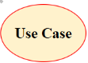
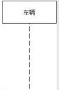
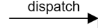
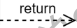
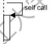
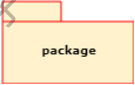
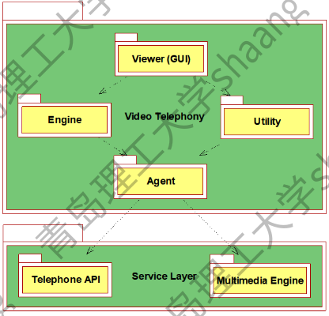
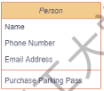
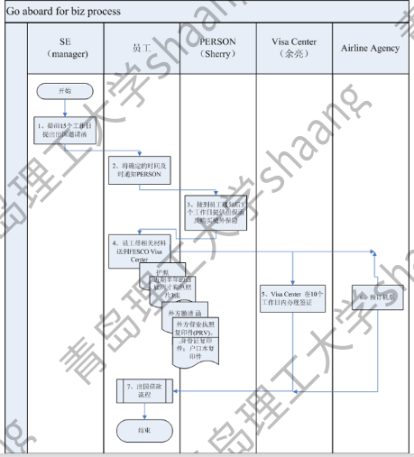

# 概述

## 软件工程发展：

1. 面向过程：以算法为基本单位，强调自顶向下的功能分解
2. 面向对象：以类为基本程序单元，对象是类的实例化，对象之间以消息传递为基本手段
3. 面向构件：寻求比类的粒度更大且易于复用的构件，期望实现软件的再工程
4. 面向服务：将软件构件化，应用业务过程由服务组成，而服务由构件组装而成

## 需求分析的过程：

捕获->挖掘->归档->确认->需求规格说明书

## 需要获取的信息

目标，问题识别，用户群，使用环境，业务流程，产品功能结构，产品信息结构，页面设计，页面交互，页面转换，页面逻辑，业务特点，数据流，性能要求

## 获取信息的方法

甲方陈述，到甲方参观考察，与甲方领导沟通，与甲方业务人员沟通，座谈会，研讨会，参与到甲方业务中，了解甲方现有系统，查看甲方提供的业务文档，调查问卷，分析现有系统，大数据

## 挖掘需求

确定功能

设计模块

确定模块间的交互

定义接口

确定性能要求

确定网络要求

确定安全性要求

设计用户交互

# 需求文档

内容：模型图+文字描述

- 用例模型-用例图
- 模块间交互-时序图，泳道图
- 模块间的依赖关系-类图，体系结构图，包图，构件图
- 业务流程，状态转换-流程图，活动图，业务逻辑图
- 产品功能结构图，产品信息结构图
- 需求场景描述-自然语言
- 用户界面初步设计
- 交互性设计-页面交互图
- 运行性能设计
- 安全性设计
- 网络设计

文档写作要求

- 使用简单直接的语言

- 一次只描述一项需求
- 使用通用的，没有歧义的术语
- 考虑测试的友好性

## 需求建模与UML语言

UML:Unified Modeling Language

- 用例图
- 时序图
- 流程图
- 泳道图
- 体系结构图
- 实施图

### 用例图:用例建模

#### 构成

参与者/角色/外部系统(Actor)：

用例(use case)

关联(Association)

使用(use)

#### 要求

- 确定系统边界，系统内部和外部分别有什么
- 参与者/角色（Actor）不一定是人类
- 1个用例= 1个功能
- 7±2原则
- 子用例 = 子功能
- 用例图也可以分层次

- 用例命名：动词+名词，名词+动词
- 用例有优先级，最核心，最常用的功能，
- 用例的粒度要适中
- 需要可以观测到的结果，有利于测试

### 时序图

#### 构成

模块/对象+生命线

发送消息

返回消息

自调用

生命线结束

#### 要求

- 描述顺序和交互
- 交互对象：模块之间，对象之间，模块和对象之间
- 描述完成一个用例（功能）时各个模块对象之间有序的交互

### 体系结构图

#### 构成

 包：类/包

依赖：调用/使用

#### 要求

- 体系结构图在类图之上相当于描述“包”之间的关系，比类图粒度大
- 为系统分层
- 描述各层之间的依赖关系
- 为系统分模块
- 描述模块之间的依赖关系
- 遵守7±2关系
- 分而治之

###  类图

#### 构成

- 类

- 继承（类对类，接口对接口）

- 实现（类对接口）

- 依赖

- 关联

- 聚合（菱形一方指向整体，另一方指向部分）

- 组合（菱形一方指向整体，箭头一方指向部分）

  

#### 要求

- 依赖--a类方法参数有b类

  依赖就是一个类A使用到了另一个类B，而这种使用关系是具有偶然性的、临时性的、非常弱的，但是类B的变化会影响到类A。比如某人要过河，需要借用一条船，此时人与船之间的关系就是依赖。表现在代码层面，为类B作为参数被类A在某个method方法中使用。在UML类图设计中，依赖关系用由类A指向类B的带箭头虚线表示。 

- 关联--a类有指针指向b类的对象

  关联体现的是两个类之间语义级别的一种强依赖关系，比如我和我的朋友，这种关系比依赖更强、不存在依赖关系的偶然性、关系也不是临时性的，一般是长期性的，而且双方的关系一般是平等的。关联可以是单向、双向的。表现在代码层面，为被关联类B以类的属性形式出现在关联类A中，也可能是关联类A引用了一个类型为被关联类B的全局变量。在UML类图设计中，关联关系用由关联类A指向被关联类B的带箭头实线表示，在关联的两端可以标注关联双方的角色和多重性标记。 

- 聚合--同关联，语义含有包含意思

  聚合是关联关系的一种特例，它体现的是整体与部分的关系，即has-a的关系。此时整体与部分之间是可分离的，它们可以具有各自的生命周期，部分可以属于多个整体对象，也可以为多个整体对象共享。比如计算机与CPU、公司与员工的关系等，比如一个航母编队包括海空母舰、驱护舰艇、舰载飞机及核动力攻击潜艇等。表现在代码层面，和关联关系是一致的，只能从语义级别来区分。在UML类图设计中，聚合关系以空心菱形加实线箭头表示。 

- 组合--a类的成员就是b类对象，且b类的一个对象只作为一个a对象成员

  组合也是关联关系的一种特例，它体现的是一种contains-a的关系，这种关系比聚合更强，也称为强聚合。它同样体现整体与部分间的关系，但此时整体与部分是不可分的，整体的生命周期结束也就意味着部分的生命周期结束，比如人和人的大脑。表现在代码层面，和关联关系是一致的，只能从语义级别来区分。在UML类图设计中，组合关系以实心菱形加实线箭头表示。  

### 其他uml图

#### 泳道图

#### 协作图

又名通信图

组成：对象+关联+消息+序号

作用与时序图类似

协作图=时序图

强调合作关系

弱化了顺序

两种图可以相互转换

#### 活动图

与流程图类似，可以表示并发

# 软件开发三大神器

- 编码规范
- 代码审查
- 代码管理

## 编码规范(programming style)

通用编码规范如下：

- 行尾不能有空格
- 用空格代替tab（4个）

- 用constant== variable而不用variable==constant形式
- 用括号"()"显式指明运算符优先级
- .......

## 代码审查(code review)

- 通过复查代码提高代码质量的过程
- 用来确认方案设计和代码实现的质量
- 手段：阅读代码 or 运行代码
- 双人，单人 or 多人
- 审查对象：潜在的bug和存在的bug
- 顺序：审查->checkin->测试

- 在项目早期发现代码中的bug
- 帮助初级开发人员学习高级开发人员的经验
- 避免开发人员犯常见普通的错误
- 保证项目组人员良好沟通
- 使代码容易维护

进入代码审查需要条件如下：

- 代码审查人员是否了解代码审查的概念和步骤
- 代码是否已经正确build，build的目的使得代码已经不存在基本语法错误，可以让审查人员将精力放在代码质量上
- 代码执行时功能是否正确
- 代码审查人员不负责检查代码功能是否正确，需要复查的代码必须由开发人员先测试功能的正确性

审查的内容：

- 完整性检查
- 一致性检查
- 正确性检查
- 可修改性检查
- 可预测性检查
- 健壮性检查
- 结构性检查
- 可追溯性检查
- 可理解性检查
- 可验证性检查

## 代码管理(source control)

- 同步(update)，合并(merge)，比较(diff)
- 版本(version)管理
- 分支(branch)管理
- 追溯
- 定责(blame)
- 权限

### CheckIn 步骤

- 代码审查：如果是新员工，必须找自己的指导老师做代码审查工作；如果是正式员工，要找自己的小组负责人做代码审查
- CheckIn 代码，具体如下：修改代码，添加文件，删除文件。注意：新员工的前三次CheckIn，都需要在培训人员监督下进行，避免出现不必要错误
- 填写并发送CheckIn mail，通知所有开发人员本次CheckIn的内容意义

checkin注意事项：

- 任何人在修改代码后，都要经过代码审查才能CheckIn代码，这样可以保证代码质量
- CheckIn代码前必须确保所有的代码通过编译。
- 修改后的代码要尽快CheckIn，不可以拖太长时间，系统代码每天都会有人修改，checkin之前必须重新获取服务器的代码(update)，重新编译检查，看看新代码加上自己的修改能否正确编译运行，如果不能就需要重新修改。
- 每次CheckIn要写CheckIn mail，要让别人知道自己做了什么事情

